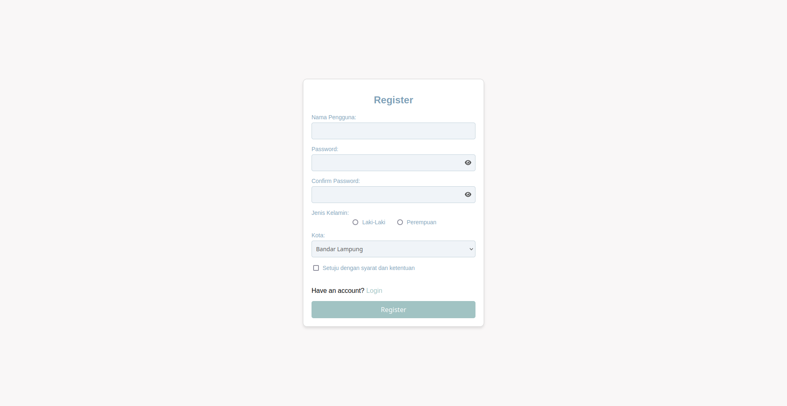
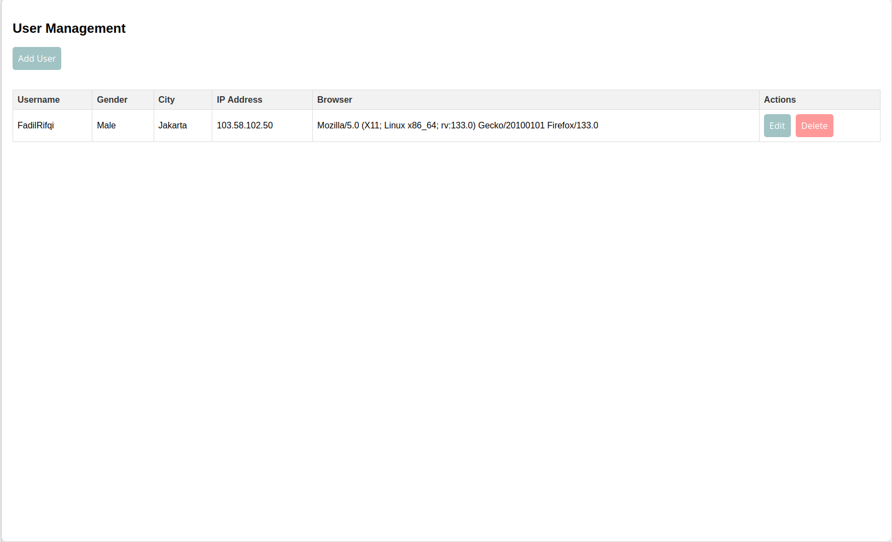

# UAS Pemweb

### Nama : Muhammad Fadil Ataullah Rifqi

### NIM : 122140205

### Kelas : RB

## Bagian 1 : Client-side Programming (Bobot: 30%)

### 1.1 Manipulasi DOM dengan JavaScript (15%)

- Buat form input dengan minimal 4 elemen input (teks, checkbox, radio, dll.)

[index.php](index.php)


- Tampilkan data dari server ke dalam sebuah tabel HTML.

[admin/dashboard/index.php](./admin/dashboard/index.php)


### 1.2 Event Handling (15%)

- Tambahkan minimal 3 event yang berbeda untuk meng-handle form pada 1.1.

[index.php](index.php)

```javascript
// Validasi form ketika input atau select diubah
$("#userForm input, #userForm select").on("input change", function() {
    validateField($(this));
});

// Event listener tambahan untuk blur
$("#userForm input, #userForm select").on("blur", function() {
    validateField($(this));
});

// Validasi register form ketika form di submit
$("#userForm").on("submit", function(e) {
    e.preventDefault();
    var isValid = true;
    $(this).find("input, select").each(function() {
    if (!validateField($(this))) {
        isValid = false;
       }
    });
    // Code Lainnya
)}

```

- Implementasikan JavaScript untuk validasi setiap input sebelum diproses oleh PHP.

[index.php](index.php)

```javascript
function validateField(element) {
  var value = element.val().trim();
  var errorMessage = '';

  // Ketika input required dan value kosong maka menampilkan pesan error "Please fill out this field."
  if (element.attr('required') && value === '') {
    errorMessage = 'Please fill out this field.';
  }

  // Ketika username kurang dari 3 karakter maka menampilkan pesan error "Username must be at least 3 characters."
  if (element.attr('name') === 'username' && value.length < 3) {
    errorMessage = 'Username must be at least 3 characters.';
  }

  // Ketika password kurang dari 8 karakter maka menampilkan pesan error "Password must be at least 8 characters."
  if (element.attr('name') === 'password' && value.length < 8) {
    errorMessage = 'Password must be at least 8 characters.';
  }

  // Ketika password tidak mengandung huruf besar dan special character maka menampilkan pesan error
  // "Password must contain at least one uppercase letter and one special character."
  if (
    element.attr('name') === 'password' &&
    !/^(?=.*[A-Z])(?=.*[!@#$%^&*])/.test(value)
  ) {
    errorMessage =
      'Password must contain at least one uppercase letter and one special character.';
  }

  // Ketika confirm password tidak sama dengan password maka menampilkan pesan error "Passwords do not match."
  if (
    element.attr('name') === 'confirmPassword' &&
    value !== $('#password').val()
  ) {
    errorMessage = 'Passwords do not match.';
  }

  // Ketika city "Others" dipilih dan input "other_city" kosong maka menampilkan pesan error "Please enter your city."
  if (
    element.attr('name') === 'other_city' &&
    $('#city').val() === 'Others' &&
    value === ''
  ) {
    errorMessage = 'Please enter your city.';
  }

  // Ketika checkbox "agree" tidak dicheck maka menampilkan pesan error "Please check this to proceed."
  if (element.attr('name') === 'agree' && !element.is(':checked')) {
    errorMessage = 'Please check this to proceed.';
  }

  // Tampilkan error message di class "error-message" jika errorMessage tidak kosong
  if (errorMessage) {
    element.next('.error-message').remove();
    element.after('<span class="error-message">' + errorMessage + '</span>');
    return false;
  } else {
    // Hapus error message jika errorMessage kosong
    element.next('.error-message').remove();
    return true;
  }
}
```

## Bagian 2: Server-side Programming (Bobot: 30%)

### 2.1 Pengelolaan Data dengan PHP (20%)

- Gunakan metode POST atau GET pada formulir.

[index.php](index.php)

```php
<form id="loginForm" method="POST" action="<?php echo getenv('APP_URL') . '/auth.php?action=login'; ?>">
// Code Lainnya
<form/>
```

- Parsing data dari variabel global dan lakukan validasi di sisi server.

[auth_controller.php](./app/controller/auth/auth_controller.php)

```php
if ($action === 'register') {
    $agree = isset($data['agree']);
    if (!$agree) {
        echo "You must agree to the terms and conditions.";
        return;
    }
    $username = htmlspecialchars($data['username'], ENT_QUOTES, 'UTF-8');
    $password = htmlspecialchars($data['password'], ENT_QUOTES, 'UTF-8');
    $gender = htmlspecialchars($data['gender'], ENT_QUOTES, 'UTF-8');
    $city = htmlspecialchars($data['city'], ENT_QUOTES, 'UTF-8');
    // Mendapatkan Public IPV4 address dari user
    $ip = file_get_contents('https://api.ipify.org');
    $browser = htmlspecialchars($_SERVER['HTTP_USER_AGENT'], ENT_QUOTES, 'UTF-8');
    // Jika query string action = register (?action=register) maka akan memanggil method register
    $result = $this->register($username, $password, $gender, $city, $ip, $browser);
    if ($result === true) {
        echo "Registration succeeded.";
    } else {
        echo $result;
    }
}
```

- Simpan ke basis data termasuk jenis browser dan alamat IP pengguna.

Setelah di validasi Insert ke database [auth_controller.php](./app/controller/auth/auth_controller.php)

```php
// Query untuk insert user baru
$stmt = $this->db->prepare("INSERT INTO users (username, password, gender, city, ip_address, browser) VALUES (:username, :password, :gender, :city, :ip, :browser)");
try {
    // Eksekusi query
    $stmt->execute([
        ':username' => $username,
        ':password' => $hashedPassword,
        ':gender' => $gender,
        ':city' => $city,
        ':ip' => $ip,
        ':browser' => $browser
    ]);
    // Jika user berhasil diinsert maka akan mengembalikan true yang akan di handle di front-end
    return true;
} catch (PDOException $e) {
    if ($e->getCode() == 23000) {
    // Code error 23000 adalah error ketika terjadi duplicate entry
    $errorMessage = $e->getMessage();
    if (strpos($errorMessage, 'username') !== false) {
        // Jika error message mengandung kata 'username' maka akan mengembalikan pesan error "Registration failed: Username already exists."
        return "Registration failed: Username already exists.";
    } elseif (strpos($errorMessage, 'ip_address') !== false) {
        // Jika error message mengandung kata 'ip_address' maka akan mengembalikan pesan error "Registration failed: User with this IP address already exists."
        return "Registration failed: User with this IP address already exists.";
    } else {
        // Default duplikat entry
        return "Registration failed: Duplicate entry.";
    }
}
    // Jika terjadi error lainnya maka akan mengembalikan pesan error
    return "Registration failed: " . $e->getMessage();
}

```

### 2.2 Objek PHP Berbasis OOP (10%)

- Buat sebuah objek PHP berbasis OOP yang memiliki minimal dua metode dan gunakan objek tersebut dalam skenario tertentu.

[base_controller.php](./app/controller/base_controller.php)

```php
class BaseController extends Connection {
    public function __construct() {
        // Memanggil constructor dari parent class
        parent::__construct();
    }


    public function generateCsrfToken() {
        if (empty($_SESSION['csrf_token'])) {
            // Membuat token CSRF jika belum ada
            $_SESSION['csrf_token'] = bin2hex(random_bytes(32));
        }
        // Mengembalikan token CSRF
        return $_SESSION['csrf_token'];
    }

    public function verifyCsrfToken($token) {
        if (!$token) {
            // Jika token kosong maka akan mengembalikan false
            return false;
        }
        // Membandingkan token yang diterima dengan token yang ada di session
        return isset($_SESSION['csrf_token']) && hash_equals($_SESSION['csrf_token'], $token);
    }
}
```

## Bagian 3: Database Management (Bobot: 20%)

### 3.1 Pembuatan Tabel Database (5%)

[db.sql](./app/database/db.sql)

```sql
CREATE TABLE IF NOT EXISTS roles (
    id INT AUTO_INCREMENT PRIMARY KEY,
    name VARCHAR(255) UNIQUE
);

CREATE TABLE IF NOT EXISTS users (
    id INT AUTO_INCREMENT PRIMARY KEY,
    role_id INT DEFAULT 2,
    username VARCHAR(255) UNIQUE NOT NULL,
    password VARCHAR(255) NOT NULL,
    gender ENUM('Male', 'Female'),
    image VARCHAR(255) DEFAULT NULL,
    city VARCHAR(255) NOT NULL,
    ip_address VARCHAR(50) UNIQUE NOT NULL,
    browser TEXT NOT NULL,

    FOREIGN KEY (role_id) REFERENCES roles(id) ON DELETE CASCADE
);

INSERT INTO roles (name) VALUES ('Admin'), ('User');


CREATE TABLE IF NOT EXISTS products (
    id INT AUTO_INCREMENT PRIMARY KEY,
    user_id INT NOT NULL,
    name VARCHAR(255) NOT NULL,
    price DECIMAL(10, 2) NOT NULL,
    image VARCHAR(255) DEFAULT NULL,
    description TEXT NOT NULL,

    FOREIGN KEY (user_id) REFERENCES users(id) ON DELETE CASCADE
);

```

### 3.2 Konfigurasi Koneksi Database (5%)

[db.php](./app/database/db.php)

```php
<?php
require_once __DIR__ . '/../config/env_loader.php';
// Load .env file
loadEnv(__DIR__ . '/../../.env');

class Connection {
    protected $db;
    protected $host;
    protected $port;
    protected $dbname;
    protected $username;
    protected $password;

    public function __construct() {
        // Set attribute dari environment variables
        $this->host = getenv('DB_HOST');
        $this->port = getenv('DB_PORT');
        $this->dbname = getenv('DB_NAME');
        $this->username = getenv('DB_USER');
        $this->password = getenv('DB_PASSWORD');

        try {
            // Pastikan environment variables sudah di-set
            if (!$this->host || !$this->port || !$this->dbname || !$this->username) {
                throw new Exception("Missing required database environment variables.");
            }

            // membuat Data Source Name (DSN) untuk PDO
            $dsn = "mysql:host={$this->host};port={$this->port};dbname={$this->dbname};charset=utf8mb4";

            // Membuat koneksi ke database
            $this->db = new PDO($dsn, $this->username, $this->password);

            // Set error mode ke exception
            $this->db->setAttribute(PDO::ATTR_ERRMODE, PDO::ERRMODE_EXCEPTION);
        } catch (PDOException $e) {
            // Jika terjadi error saat koneksi ke database maka akan menampilkan pesan error
            die("Database connection failed: " . $e->getMessage());
        }
    }

    // Method untuk mendapatkan koneksi database
    public function getDb() {
        return $this->db;
    }
}

```

### 3.3 Manipulasi Data pada Database (10%)

Manipulasi Database Dilakukan di Controller

[app/controller](./app/controller)

## Bagian 4: State Management (Bobot: 20%)

### 4.1 State Management dengan Session (10%)

- Gunakan session_start() untuk memulai session.

session_start() di declare pada [base_controller.php](./app/controller/base_controller.php)

```php
<?php
// Mulai Session
session_start();

//Code Lainnya
```

- Simpan informasi pengguna ke dalam session.

### 4.2 Pengelolaan State dengan Cookie dan Browser Storage (10%)

- Buat fungsi untuk menetapkan, mendapatkan, dan menghapus cookie.

```javascript
// Menyimpan cart ke cookies
$('.add-to-cart').on('click', function () {
  const productId = $(this).data('id');
  const productName = $(this).data('name');
  const productPrice = $(this).data('price');
  const imagePath = $(this).data('image');
  const product = {
    id: productId,
    name: productName,
    price: productPrice,
    image: imagePath,
  };

  let cart = [];
  const cartCookie = getCookie('cart');
  if (cartCookie) {
    cart = JSON.parse(cartCookie);
  }

  cart.push(product);
  setCookie('cart', JSON.stringify(cart), 7);
  toastr.success('Product added to cart');
});

// Mendapatkan Cookie
function getCookie(name) {
  const nameEQ = name + '=';
  const ca = document.cookie.split(';');
  for (let i = 0; i < ca.length; i++) {
    let c = ca[i];
    while (c.charAt(0) == ' ') c = c.substring(1, c.length);
    if (c.indexOf(nameEQ) == 0) return c.substring(nameEQ.length, c.length);
  }
  return null;
}

// Menghapus Cookie
$('.remove-button').on('click', function () {
  const index = $(this).data('index');
  cart.splice(index, 1);
  setCookie('cart', JSON.stringify(cart), 7);
  $(this).parent().remove();
  if (cart.length === 0) {
    $('#main-content').html(
      '<h2>My Cart</h2><p>Your cart is empty.</p><button class="back-button"><i class="fas fa-arrow-left"></i>Back to Products</button>'
    );
    $('.back-button').on('click', function () {
      location.reload();
    });
  }
});
```

- Gunakan browser storage untuk menyimpan informasi secara lokal.

[navbar.php](./user/components/navbar.php)

```php
// Cek preferensi dark mode dari localStorage saat halaman dimuat
if (localStorage.getItem('darkMode') === 'enabled') {
    $('body').addClass('dark-mode');
    $('#dark-mode-icon').removeClass('fa-moon').addClass('fa-sun');
}

// Toggle dark mode dan simpan preferensi ke localStorage
$('.toggle-dark-mode').click(function() {
    $('body').toggleClass('dark-mode');
    if ($('body').hasClass('dark-mode')) {
        localStorage.setItem('darkMode', 'enabled');
        $('#dark-mode-icon').removeClass('fa-moon').addClass('fa-sun');
    } else {
        localStorage.removeItem('darkMode');
        $('#dark-mode-icon').removeClass('fa-sun').addClass('fa-moon');
    }
});
```

### Bagian Bonus: Hosting Aplikasi Web (Bobot: 20%)

- (5%) Apa langkah-langkah yang Anda lakukan untuk meng-host aplikasi web Anda?

1. Mencari penyedia hosting
2. Menyiapkan database dan mengkonfigurasi database
3. Ubah dns dari Domain agar menunjuk ke dns tempat penyedia hosting
4. Tunggu sampai masa propagasi selama 1 x 24 jam
5. Upload Source Code ke file manager

- (5%) Pilih penyedia hosting web yang menurut Anda paling cocok untuk aplikasi web Anda.

  Saya menggunakan layanan Biznet Gio Nusantara karena harganya yang murah

- (5%) Bagaimana Anda memastikan keamanan aplikasi web yang Anda host?

  Layanan Biznet Gio Nusantara telah menyediakan _DDOS Protection_, tidak hanya itu saya juga memaksimalkan keamanan web saya dengan mengimplementasikan CSRF Token

- (5%) Jelaskan konfigurasi server yang Anda terapkan untuk mendukung aplikasi web Anda.

  Tidak ada konfigurasi khusus hanya konfigurasi database, karena untuk web server telah di konfigurasi dari pihak Biznet Gio Nusantara

##

### Plugin dan library yang digunakan :

- jQuery: Library JavaScript yang memudahkan manipulasi dokumen HTML, penanganan event, animasi, dan interaksi AJAX.

- Toastr: Plugin jQuery untuk menampilkan notifikasi toast.

- Font Awesome: Library ikon yang menyediakan berbagai ikon vektor yang dapat disesuaikan.
